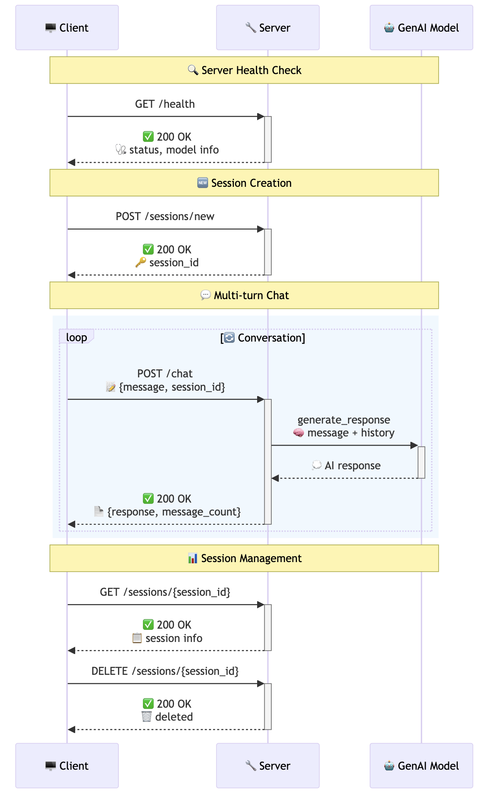
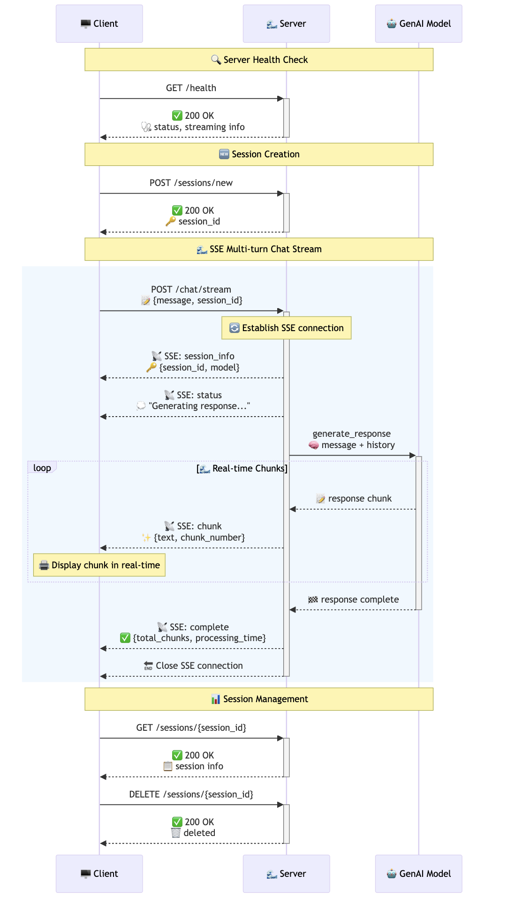
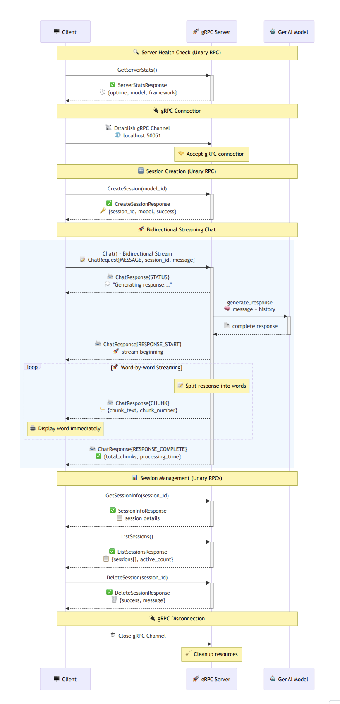

# GenAI Transport Protocols

A comprehensive implementation showcase demonstrating **five different transport protocols** for building real-time AI chat applications using Google's Gemini model. This repository explores the performance, complexity, and use-case differences between various communication protocols for streaming AI responses.

<div align="center">
  
</div>

## 🚀 Overview

This project implements the **same multi-turn chat functionality** using five different transport protocols, allowing developers to compare and choose the best approach for their specific needs:

1. **[REST HTTP](protocols/http_rest/)** - Traditional request/response pattern
2. **[Streamable HTTP](protocols/streamable_http/)** - HTTP chunked transfer encoding
3. **[Server-Sent Events (SSE)](protocols/sse/)** - Real-time event streaming
4. **[WebSockets](protocols/websocket/)** - Full bidirectional communication
5. **[gRPC](protocols/grpc/)** - High-performance binary protocol

## 🏗️ Architecture Overview

All implementations share the same core components:

- **Multi-turn Context**: Persistent conversation history across all protocols
- **Session Management**: Independent conversations with UUID-based sessions  
- **Google Gemini Integration**: Consistent AI model across all implementations
- **Interactive Clients**: Rich CLI clients with session management commands
- **Performance Monitoring**: Detailed statistics and connection tracking

## 📋 Transport Protocol Details

### 1. REST HTTP
**Traditional request/response pattern for simple chat applications**

```bash
cd protocols/http_rest
python server.py  # Terminal 1
python client.py  # Terminal 2
```

- ✅ Simple implementation
- ✅ Universal compatibility  
- ✅ Easy debugging
- ❌ No real-time streaming
- ❌ Higher latency per message

### 2. Streamable HTTP
**HTTP chunked transfer encoding for real-time response streaming**

```bash
cd protocols/streamable_http
python server.py  # Terminal 1
python client.py  # Terminal 2
```

- ✅ Real-time streaming responses
- ✅ Standard HTTP compatibility
- ✅ NDJSON protocol
- ✅ Works with any HTTP client
- ❌ One-way communication only

### 3. Server-Sent Events (SSE)
**Event-driven real-time streaming with native browser support**

```bash
cd protocols/sse
python server.py  # Terminal 1
python client.py  # Terminal 2
```

- ✅ Native browser EventSource API
- ✅ Automatic reconnection
- ✅ Structured event types
- ✅ Built-in error handling
- ❌ One-way communication only

### 4. WebSockets
**Full bidirectional real-time communication**

```bash
cd protocols/websocket
python server.py  # Terminal 1
python client.py  # Terminal 2
```

- ✅ Full bidirectional communication
- ✅ Real-time typing indicators
- ✅ Session broadcasting
- ✅ Persistent connections
- ✅ Interactive web demo

### 5. gRPC
**High-performance binary protocol with type safety**

```bash
cd protocols/grpc
python setup.py     # Generate Protocol Buffers
python server.py    # Terminal 1
python client.py    # Terminal 2
```

- ✅ High performance binary protocol
- ✅ Strong type safety with Protocol Buffers
- ✅ Bidirectional streaming
- ✅ Built-in compression and multiplexing
- ✅ Cross-language compatibility

## 🎯 Quick Start

### Prerequisites
```bash
pip install -r requirements.txt
export GENAI_MODEL_ID="gemini-2.0-flash"  # Optional, defaults to gemini-2.0-flash
```

### Run Any Protocol
Choose your protocol and run both server and client:

```bash
# Example: WebSocket implementation
cd protocols/websocket
python server.py    # Start server (Terminal 1)
python client.py    # Start client (Terminal 2)
```

### Universal Client Commands
All clients support the same command set:

| Command | Action |
|---------|--------|
| `/help` | Show available commands |
| `/new` | Create new chat session |
| `/sessions` | List all active sessions |
| `/info` | Show current session details |
| `/stats` | Display client statistics |
| `/server` | Show server statistics |
| `/health` | Check server health |
| `/docs` | Open API documentation (web protocols) |
| `/demo` | Open interactive demo (where available) |
| `/quit` | Exit client |

## 📈 Protocol Flow Diagrams

Understanding how each protocol handles the conversation flow:

### REST HTTP Flow


Traditional request/response pattern with session context preservation.

### Streamable HTTP Flow  


HTTP chunked encoding enables real-time streaming with NDJSON format.

### Server-Sent Events Flow


Event-driven streaming with automatic reconnection and structured event types.

### WebSocket Flow


Bidirectional real-time communication supporting typing indicators and session broadcasting.

### gRPC Flow


High-performance binary streaming with Protocol Buffers and type safety.

## 🎛️ Interactive Demos

Several protocols include interactive web demos:

| Protocol | Demo URL | Features |
|----------|----------|----------|
| **WebSocket** | http://localhost:8000/demo | Real-time bidirectional chat |
| **SSE** | http://localhost:8000/demo | Live streaming responses |
| **Streamable HTTP** | http://localhost:8000/demo | Chunked response display |
| **REST HTTP** | http://localhost:8000/docs | API documentation |

## 🛠️ Technology Stack

### Core Technologies
- **Python 3.8+**: Primary development language
- **FastAPI**: Modern async web framework (REST, SSE, Streamable HTTP, WebSocket)
- **gRPC**: High-performance RPC framework
- **Google GenAI**: Gemini model integration
- **Pydantic**: Data validation and serialization

### Protocol-Specific Libraries
- **WebSockets**: Native Python websockets library
- **SSE**: sse-starlette for Server-Sent Events
- **gRPC**: grpcio and grpcio-tools for Protocol Buffers
- **HTTP**: httpx for async HTTP client operations

### Development Tools
- **Uvicorn**: ASGI server for FastAPI applications
- **Colorama**: Cross-platform colored terminal output
- **Rich**: Enhanced console formatting and logging

## 📁 Project Structure

```
genai-transport-protocols/
├── protocols/
│   ├── http_rest/           # Traditional REST API
│   │   ├── server.py
│   │   ├── client.py
│   │   └── README.md
│   ├── streamable_http/     # HTTP chunked encoding
│   │   ├── server.py
│   │   ├── client.py
│   │   └── README.md
│   ├── sse/                 # Server-Sent Events
│   │   ├── server.py
│   │   ├── client.py
│   │   └── README.md
│   ├── websocket/           # WebSocket implementation
│   │   ├── server.py
│   │   ├── client.py
│   │   └── README.md
│   └── grpc/                # gRPC implementation
│       ├── server.py
│       ├── client.py
│       ├── setup.py
│       ├── chat.proto
│       └── README.md
├── sequence_diagrams/       # Protocol flow diagrams
│   ├── rest.png
│   ├── streamable_http.png
│   ├── sse.png
│   ├── websockets.png
│   └── grpc.png
├── shared/                  # Common utilities
│   ├── io.py               # Input/output utilities
│   ├── llm.py              # AI model integration
│   ├── logger.py           # Logging utilities
│   └── setup.py            # Common setup functions
├── requirements.txt         # Python dependencies
└── README.md               # This file
```

## 🤝 Contributing

1. Fork the repository
2. Create a feature branch
3. Add your transport protocol implementation
4. Follow the existing patterns for session management and client commands
5. Include comprehensive documentation and examples
6. Submit a pull request

#