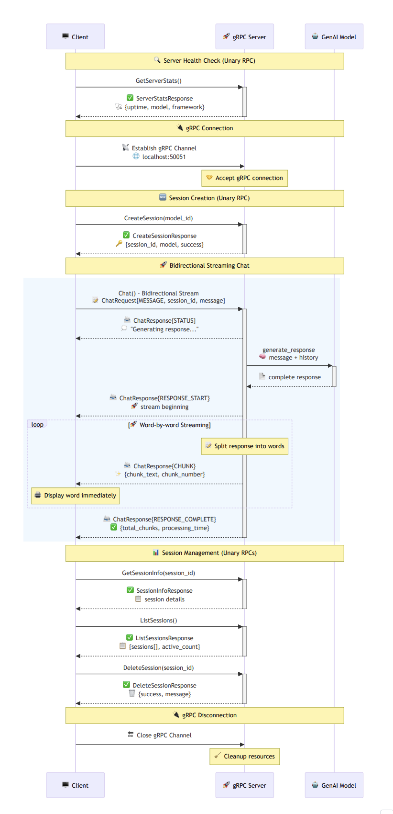

# Protocol: gRPC

High-performance bidirectional streaming multi-turn chat server and client implementation using gRPC, Protocol Buffers, and simulated streaming communication.

<div align="center">

### gRPC Flow


*High-performance binary streaming with Protocol Buffers and type safety*

</div>

## Quick Start

**Prerequisites**

```bash
pip install -r requirements.txt
export GENAI_MODEL_ID="gemini-2.0-flash"  # Optional, defaults to gemini-2.0-flash
```

**Initial Setup**

**Before running any server.py, execute these commands from the project root:**

```bash
export PYTHONDONTWRITEBYTECODE=1 PYTHONPATH=$PYTHONPATH:.
```

**Important**: These environment variables must be set from the root directory of the project to ensure proper module imports and clean Python execution.

**Generate gRPC Code**

```bash
cd protocols/grpc
python setup.py
```

**Run the Protocol**

```bash
# 1. Start server (Terminal 1)
python protocols/grpc/server.py

# 2. Start client (Terminal 2)
python protocols/grpc/client.py
```

**Server**: localhost:50051  
**Protocol**: gRPC with bidirectional streaming  
**Proto File**: chat.proto with strongly-typed messages

## Server Implementation

- **Synchronous gRPC Server**: High-performance server with bidirectional streaming
- **Multi-turn Chat Sessions**: Context-aware conversations with session state management
- **Session Storage**: In-memory session management with comprehensive metadata
- **Simulated Stream Processing**: Word-by-word response streaming for real-time experience
- **Request Routing**: Intelligent routing of different request types
- **Performance Monitoring**: Detailed statistics and metrics collection
- **Error Handling**: Comprehensive gRPC error handling and status codes
- **Protocol Buffers**: Strongly-typed message definitions with schema validation

## Client Implementation

- **Synchronous gRPC Client**: Robust client with bidirectional streaming support
- **Real-time Display**: Live message display as words arrive from server
- **Session Management**: Create, join, delete, and manage chat sessions
- **Interactive Commands**: Full session and server management via CLI
- **Connection Management**: Robust connection handling with proper cleanup
- **Type-safe Communication**: Protocol Buffers ensure message integrity
- **Performance Tracking**: Detailed client-side statistics and timing

## Client Commands

### Basic Commands
| Command | Action |
|---------|--------|
| `/help` | Show all available commands |
| `/stats` | Show client session statistics |
| `/server` | Display server statistics |
| `/health` | Check server health |
| `/clear` | Clear screen |
| `/quit` | Exit client |

### gRPC Commands
| Command | Action |
|---------|--------|
| `/connect` | Connect to gRPC server |
| `/disconnect` | Disconnect from gRPC server |
| `/ping` | Send ping to test connection |

### Session Management
| Command | Action |
|---------|--------|
| `/new` | Create a new chat session |
| `/info` | Show current session details |
| `/sessions` | List all active sessions |
| `/delete` | Delete current session |

## gRPC Service Definition

### Service Methods
- `CreateSession` - Create a new chat session
- `GetSessionInfo` - Get detailed session information
- `ListSessions` - List all active sessions
- `DeleteSession` - Delete a specific session
- `GetServerStats` - Get server performance statistics
- `Chat` - Bidirectional streaming chat communication

### Protocol Buffers Schema

```protobuf
service ChatService {
  rpc CreateSession(CreateSessionRequest) returns (CreateSessionResponse);
  rpc GetSessionInfo(SessionInfoRequest) returns (SessionInfoResponse);
  rpc ListSessions(ListSessionsRequest) returns (ListSessionsResponse);
  rpc DeleteSession(DeleteSessionRequest) returns (DeleteSessionResponse);
  rpc GetServerStats(ServerStatsRequest) returns (ServerStatsResponse);
  rpc Chat(stream ChatRequest) returns (stream ChatResponse);
}

message ChatRequest {
  enum Type {
    MESSAGE = 0;
    PING = 1;
    TYPING_START = 2;
    TYPING_STOP = 3;
  }
  
  Type type = 1;
  string session_id = 2;
  string message = 3;
  string timestamp = 4;
}

message ChatResponse {
  enum Type {
    STATUS = 0;
    RESPONSE_START = 1;
    CHUNK = 2;
    RESPONSE_COMPLETE = 3;
    ERROR = 4;
    PONG = 5;
    SESSION_UPDATE = 6;
  }
  
  Type type = 1;
  string session_id = 2;
  string status_message = 3;
  int32 context_messages = 4;
  string chunk_text = 5;
  int32 chunk_number = 6;
  int32 total_chunks = 7;
  double processing_time = 8;
  int32 message_count = 9;
  string error_message = 10;
  string timestamp = 11;
}
```

## Configuration

Set environment variable:
```bash
export GENAI_MODEL_ID="your-model-id"  # Default: gemini-2.0-flash
```

## Sample Output

### gRPC Server Startup
```
══════════════════════════════════════════════════════════════
               🚀 GRPC MULTI-TURN CHAT SERVER 🚀               
══════════════════════════════════════════════════════════════
  Model: gemini-2.0-flash                                      
  Framework: gRPC + Async Streaming                            
  Multi-turn: ENABLED                                          
  Streaming: BIDIRECTIONAL                                     
  Status: READY                                                
══════════════════════════════════════════════════════════════

🚀 gRPC Multi-turn Chat Server starting up...
🌐 Server endpoint: localhost:50051
📡 Protocol: gRPC with bidirectional streaming
🔧 Use Ctrl+C to stop the server

✅ gRPC server started successfully!
🌐 Listening on: localhost:50051
📡 Protocol: gRPC with bidirectional streaming
🔧 Press Ctrl+C to stop
════════════════════════════════════════════════════════════
```

### Real-time Client Interface
```
🚀 GRPC MULTI-TURN CHAT CLIENT 🚀
🎉 gRPC server is available!
🚀 Auto-connecting to gRPC server...

─ 🚀 GRPC CONNECTED [14:32:15.123] ─────────────────────────────
 Server: localhost:50051                                       
 Framework: gRPC + Async Streaming                             
 Protocol: gRPC                                               
 Streaming: BIDIRECTIONAL                                     
────────────────────────────────────────────────────────────

✅ gRPC connected successfully!
✨ New session created: e5f6g7h8... (gemini-2.0-flash)

You [e5f6g7h8...] ● › Explain quantum computing

─ 📤 GRPC MESSAGE SENT [14:32:16.456] ──────────────────────────
 Type: Chat                                                   
 Session: e5f6g7h8...                                        
 Message: "Explain quantum computing"                        
────────────────────────────────────────────────────────────

💭 Generating response... (Context: 1 messages)

🤖  AI Response (gRPC Streaming)  (e5f6g7h8... - gemini-2.0-flash)
────────────────────────────────────────────────────────────
Quantum computing is a revolutionary approach to information 
processing that leverages the principles of quantum mechanics 
to perform calculations in ways that classical computers cannot. 
Unlike traditional computers that use bits (0s and 1s), quantum 
computers use quantum bits or "qubits" that can exist in multiple 
states simultaneously through a property called superposition...
────────────────────────────────────────────────────────────

─ 🚀 GRPC RESPONSE COMPLETED [14:32:18.234] ────────────────────
 Total Chunks: 23                                            
 Total Time: 1.734s                                          
 Context Messages: 2                                         
 Protocol: gRPC Stream                                       
 Status: SUCCESS                                              
────────────────────────────────────────────────────────────

You [e5f6g7h8...] ● › 
```

### gRPC Server Logs
```
─ 📨 GRPC REQUEST [14:32:16.456] ────────────────────────────────
 Method: Chat                                                 
 Session: e5f6g7h8...                                        
 Message: "Explain quantum computing"                        
────────────────────────────────────────────────────────────

─ 🧠 GENERATING RESPONSE [14:32:16.500] ────────────────────────
 Session: e5f6g7h8...                                        
 Context Messages: 1                                         
 Model: gemini-2.0-flash                                     
 Protocol: gRPC Stream                                       
────────────────────────────────────────────────────────────

🚀 [14:32:16.789] Chunk #1 → e5f6g7h8...: "Quantum computing is..."
🚀 [14:32:16.856] Chunk #2 → e5f6g7h8...: "a revolutionary approach..."
🚀 [14:32:16.923] Chunk #3 → e5f6g7h8...: "to information processing..."

─ 🚀 GRPC RESPONSE COMPLETED [14:32:18.234] ────────────────────
 Session: e5f6g7h8...                                        
 Total Chunks: 23                                            
 Processing Time: 1.734s                                     
 Context Messages: 2                                         
 Protocol: gRPC Stream                                       
 Status: SUCCESS                                              
────────────────────────────────────────────────────────────
```

### Session Management
```
You [e5f6g7h8...] ● › /sessions

─ 📋 ALL ACTIVE SESSIONS (3) ────────────────────────────────
 1. e5f6g7h8... (8 msgs, 5m, 14:26:52) ← CURRENT           
 2. i9j0k1l2... (12 msgs, 12m, 14:15:30)                   
 3. m3n4o5p6... (3 msgs, 2m, 14:30:15)                     
────────────────────────────────────────────────────────────

You › /stats

─ 📊 CLIENT SESSION STATISTICS ──────────────────────────────
 Client Session Duration: 0:15:23                           
 Messages Sent: 12                                          
 Successful Streams: 11                                     
 Failed Streams: 1                                          
 Total Chunks Received: 267                                 
 Avg Chunks per Stream: 24.3                               
 Connection Attempts: 2                                     
 Reconnections: 1                                           
 Sessions Created: 2                                        
 Avg Response Time: 2.456s                                 
 gRPC Status: Connected                                     
 Current Session: e5f6g7h8...                              
 Session Messages: 8                                        
────────────────────────────────────────────────────────────

You › /server

─ 🖥️  GRPC SERVER STATISTICS ─────────────────────────────────
 Server Uptime: 1:23:45                                     
 Total Requests: 89                                         
 Successful: 85                                             
 Failed: 4                                                  
 Active Sessions: 3                                         
 Total Sessions Created: 8                                  
 Avg Response Time: 2.234s                                 
 Model: gemini-2.0-flash                                    
 Framework: gRPC + Async Streaming                          
────────────────────────────────────────────────────────────
```

