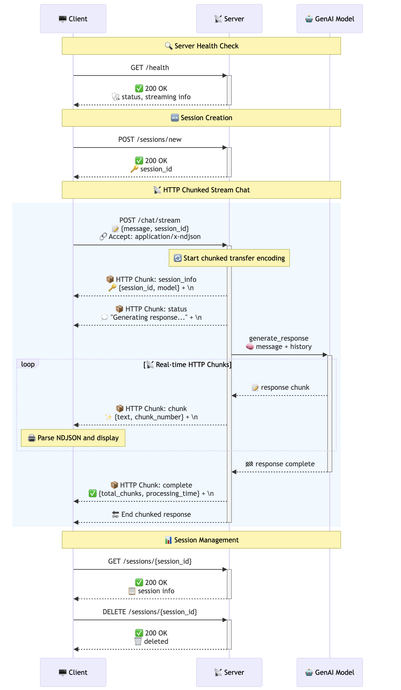

# Protocol: Streamable HTTP

Real-time streaming multi-turn chat server and client implementation using HTTP chunked transfer encoding, session management, and live response streaming.

<div align="center">

### Streamable HTTP Flow  


*HTTP chunked encoding enables real-time streaming with NDJSON format*

</div>

## Quick Start

**Prerequisites**

```
pip install -r requirements.txt
export GENAI_MODEL_ID="gemini-2.0-flash"  # Optional, defaults to gemini-2.0-flash
```

**Initial Setup**
**Before running any server.py, execute these commands from the project root:**

```
export PYTHONDONTWRITEBYTECODE=1 PYTHONPATH=$PYTHONPATH:.
```

**Important**: These environment variables must be set from the root directory of the project to ensure proper module imports and clean Python execution.

**Run the Protocol**

```
# 1. Start server (Terminal 1)
python protocols/streamable_http/server.py

# 2. Start client (Terminal 2)
python protocols/streamable_http/client.py
```

**Optional: Try the web demo**
```
# Visit http://localhost:8000/demo
```

**Server**: http://localhost:8000  
**API Docs**: http://localhost:8000/docs  
**HTTP Demo**: http://localhost:8000/demo

## Server Implementation

- **HTTP Streaming Engine**: Real-time response streaming using FastAPI + StreamingResponse
- **Multi-turn Chat Sessions**: Context-aware conversations with streaming responses
- **Connection Management**: Track and monitor active HTTP streaming connections
- **Stream Lifecycle Logging**: Detailed logs for stream start, chunks, and completion
- **Session Isolation**: Multiple independent streaming conversations
- **Performance Monitoring**: Stream statistics, timing, and connection metrics
- **Interactive Demo Page**: Built-in web interface for testing HTTP streaming functionality
- **Auto-generated API Documentation**: Interactive OpenAPI schema with streaming endpoints

## Client Implementation

- **Real-time Stream Processing**: Live display of AI responses as they arrive via HTTP
- **Multi-turn Session Management**: Create, switch, and manage streaming chat sessions
- **Stream State Monitoring**: Visual indicators for active streams and session context
- **Chunk-by-chunk Display**: Smooth real-time text rendering as responses stream in
- **Connection Recovery**: Graceful handling of stream interruptions and reconnections
- **Session Statistics**: Track streaming performance, chunks received, and timing
- **Interactive Commands**: Full session management during live conversations

## Client Commands

### Basic Commands
| Command | Action |
|---------|--------|
| `/help` | Show all available commands |
| `/stats` | Show client streaming statistics |
| `/server` | Display server and streaming statistics |
| `/health` | Check server health and active streams |
| `/docs` | Open API documentation in browser |
| `/demo` | Open interactive HTTP streaming demo page |
| `/clear` | Clear screen |
| `/quit` | Exit client |

### Session Management
| Command | Action |
|---------|--------|
| `/new` | Create a new streaming chat session |
| `/info` | Show current session details |
| `/sessions` | List all active sessions on server |
| `/reset` | Clear current session history |
| `/delete` | Delete current session |

## API Endpoints

### Streaming Chat Endpoints
- `POST /chat/stream` - Start HTTP stream for chat message with session context
- `POST /sessions/new` - Create a new chat session for streaming
- `GET /sessions/{session_id}` - Get session information and message history
- `DELETE /sessions/{session_id}` - Delete a specific session
- `POST /sessions/{session_id}/clear` - Clear session conversation history
- `GET /sessions` - List all active sessions with streaming capability

### System Endpoints
- `GET /health` - Health check with streaming connection statistics
- `GET /stats` - Detailed server statistics including stream metrics
- `GET /demo` - Interactive web-based HTTP streaming demo page
- `GET /docs` - Interactive API documentation
- `GET /` - Server information and available streaming endpoints

## HTTP Streaming Protocol

The streaming endpoint uses standard HTTP with chunked transfer encoding and NDJSON format:

### Request Headers
```http
POST /chat/stream HTTP/1.1
Content-Type: application/json
Accept: application/x-ndjson
```

### Response Headers
```http
HTTP/1.1 200 OK
Content-Type: application/x-ndjson
Transfer-Encoding: chunked
Cache-Control: no-cache
Connection: keep-alive
```

### NDJSON Stream Format
Each line in the response is a separate JSON object:

```json
{"type": "session_info", "session_id": "...", "model": "gemini-2.0-flash", "timestamp": "..."}
{"type": "status", "message": "Generating response...", "context_messages": 4}
{"type": "chunk", "text": "Hello there!", "chunk_number": 1, "is_final": false, "timestamp": "..."}
{"type": "chunk", "text": "How can I", "chunk_number": 2, "is_final": false, "timestamp": "..."}
{"type": "chunk", "text": "help you today?", "chunk_number": 3, "is_final": true, "timestamp": "..."}
{"type": "complete", "total_chunks": 3, "processing_time": 1.23, "message_count": 6, "session_id": "...", "timestamp": "..."}
```

## Configuration

Set environment variable:
```bash
export GENAI_MODEL_ID="your-model-id"  # Default: gemini-2.0-flash
```

## Sample Output

### HTTP Streaming Server Logs
```
══════════════════════════════════════════════════════════════
             📡 FASTAPI STREAMABLE HTTP CHAT SERVER 📡         
══════════════════════════════════════════════════════════════
  Model: gemini-2.0-flash                                      
  Framework: FastAPI + HTTP Streaming                          
  Multi-turn: ENABLED                                          
  Streaming: CHUNKED HTTP                                      
  Status: READY                                                
══════════════════════════════════════════════════════════════

─ 📡 HTTP STREAM STARTED [14:32:15.123] ───────────────────────
 Client IP: 127.0.0.1                                          
 Session: a1b2c3d4...                                         
 Message: "Explain quantum computing"                          
 Active Streams: 1                                            
 Transfer-Encoding: chunked                                    
────────────────────────────────────────────────────────────

📡 [14:32:15.456] Chunk #1: "Quantum computing is a..."
📡 [14:32:15.523] Chunk #2: "revolutionary approach to..."
📡 [14:32:15.598] Chunk #3: "information processing that..."

─ 📡 HTTP STREAM COMPLETED [14:32:17.234] ──────────────────────
 Session: a1b2c3d4...                                         
 Total Chunks: 23                                            
 Total Time: 2.111s                                          
 Active Streams: 0                                           
 Status: SUCCESS                                              
────────────────────────────────────────────────────────────
```

### Real-time Client Interface
```
📡 FASTAPI STREAMABLE HTTP CHAT CLIENT 📡
🎉 Connected to FastAPI HTTP streaming server successfully!
📡 HTTP chunked streaming enabled - responses will appear as they're generated!

You [a1b2c3d4...] › Explain quantum computing

💭 Generating response... (Context: 6 messages)

🤖 AI Response (HTTP Streaming) (a1b2c3d4... - gemini-2.0-flash)
────────────────────────────────────────────────────────────
Quantum computing is a revolutionary approach to information 
processing that leverages the principles of quantum mechanics 
to perform calculations in ways that classical computers cannot. 
Unlike traditional computers that use bits (0s and 1s), quantum 
computers use quantum bits or "qubits" that can exist in multiple 
states simultaneously through a property called superposition...
────────────────────────────────────────────────────────────

─ 📡 HTTP STREAM COMPLETED [14:32:17.234] ─────────────────────
 Total Chunks: 23                                            
 Total Time: 2.111s                                          
 Context Messages: 8                                         
 Transfer-Encoding: chunked                                   
 Status: SUCCESS                                              
────────────────────────────────────────────────────────────
```

### Interactive Web Demo
```
You › /demo
📡 Opening HTTP streaming demo page in your browser...
   URL: http://localhost:8000/demo

# Browser opens with interactive chat interface
# Real-time HTTP streaming visible in web UI with:
# - Live text appearing as it's generated via fetch() API
# - Session management through web interface
# - Visual indicators for chunked transfer encoding
# - Real-time JSON parsing of NDJSON stream
```

### Session Management During Streaming
```
You [a1b2c3d4...] › /info

─ 📋 SESSION INFO ────────────────────────────────────────────
 Session ID: a1b2c3d4...                                      
 Model: gemini-2.0-flash                                      
 Total Messages: 8                                            
 User Messages: 4                                             
 AI Messages: 4                                               
 Duration: 0:05:23                                            
 Created: 14:26:52                                            
──────────────────────────────────────────────────────────────

You › /sessions

─ 📋 ALL ACTIVE SESSIONS (3) ────────────────────────────────
 1. a1b2c3d4... (8 msgs, 0:05:23, 14:26:52) ← CURRENT       
 2. e5f6g7h8... (12 msgs, 0:12:45, 14:15:30)                
 3. i9j0k1l2... (3 msgs, 0:02:10, 14:30:15)                 
──────────────────────────────────────────────────────────────

You › /new
✨ New session created successfully!
   Session ID: m3n4o5p6...
   Model: gemini-2.0-flash

You [m3n4o5p6...] › Hello! This is a new HTTP streaming conversation
💭 Generating response... (Context: 1 messages)

🤖 AI Response (HTTP Streaming) (m3n4o5p6... - gemini-2.0-flash)
────────────────────────────────────────────────────────────
Hello! Welcome to our new HTTP streaming conversation! I'm 
excited to chat with you using chunked transfer encoding. 
You'll see my responses appear word by word as I generate...
────────────────────────────────────────────────────────────
```

### HTTP Streaming Statistics
```
You › /stats

─ 📊 CLIENT SESSION STATISTICS ──────────────────────────────
 Client Session Duration: 0:15:23                             
 Messages Sent: 12                                           
 Successful Streams: 11                                      
 Failed Streams: 1                                           
 Total Chunks Received: 267                                  
 Avg Chunks per Stream: 24.3                                
 Sessions Created: 2                                         
 Avg Response Time: 2.456s                                  
 Current Session: a1b2c3d4...                               
 Session Messages: 8                                         
────────────────────────────────────────────────────────────

You › /server

─ 🖥️  HTTP STREAMING SERVER STATISTICS ──────────────────────
 Server Uptime: 1:23:45                                      
 Total Requests: 47                                          
 Successful: 45                                              
 Failed: 2                                                   
 Active Sessions: 3                                          
 Active Streams: 0                                           
 Total Sessions Created: 8                                   
 Avg Response Time: 2.234s                                  
 Model: gemini-2.0-flash                                     
 Framework: FastAPI + HTTP Streaming                         
────────────────────────────────────────────────────────────
```